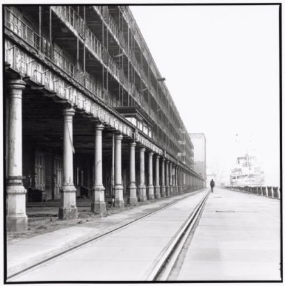
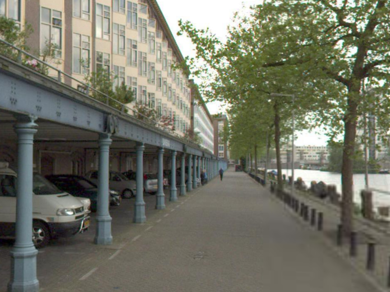

# AmsterTime: A Visual Place Recognition Benchmark Dataset for Severe Domain Shift

This repository contains AmsterTime dataset and its offical evaluation code for [AmsterTime: A Visual Place Recognition Benchmark Dataset for Severe Domain Shift](https://arxiv.org/abs/2203.16291).

The dataset consists of image pairs from historical Amsterdam and corresponding current street-view of the same place with evaluation code. The pairs are collected using crowd-sourcing methods. For a given historical image, which contains a view of a place in Amsterdam and has a provided approximate location on the map, volunteers find the best shot point of that image by moving around on the street-view application and once they believe that they find the best point, a screenshot is taken. After this process, each found pair passes from moderator verification. There are currectly 1231 verified pairs. The following is a sample pair in the dataset:

|              |  |
| :------------------------------------------------------------------------------: | :------------------------------------------------------------------: |
| Historical image from [Amsterdam Beeldbank](https://archief.amsterdam/beeldbank) |            Corresponding street-view image from Mapillary            |

And the visualization of the dataset using t-SNE:


For other and bigger versions of the visualazations: [t-SNE Visualizations](https://surfdrive.surf.nl/files/index.php/f/10154927926)

For more information please refer to [the paper](https://arxiv.org/abs/2203.16291)

## Download AmsterTime Dataset

AmsterTime dataset is published at [here](https://doi.org/10.4121/19580806). The dataset has also been shared via Kaggle at [this link](https://www.kaggle.com/datasets/byildiz/amstertime).

The dataset directory structure:

```
├── description.md: short description of the dataset
├── image_pairs.csv: information on image pairs and their sources
├── new
│   ├── 0000.png
│   ├── 0001.png
│   ├── 0002.png
│   ├── 0003.png
│   └── ...
└── old
    ├── 0000.jpg
    ├── 0001.jpg
    ├── 0002.jpg
    ├── 0003.jpg
    └── ...
```

## Requirements

First of all you need to install [conda](https://docs.conda.io/en/latest/) (miniconda or anaconda). Once the conda is installed, you can create an environment with the required dependecies by running:

```
conda env create -f environment.yml -n amstertime
```

Then you can activate the created conda environment by running:

```
conda activate amstertime
```

If you want to use t-SNE visualization script, you also need to install Barners-Hut t-SNE from [here](https://github.com/lvdmaaten/bhtsne).

## Tasks

### Verification

Verification is a binary classification (auxiliary) task to detect a pair of archival and street view images of the same place.

### Retrieval

For the retrieval task, AmsterTime dataset offers 1231 query images where the leave-one-out set serves as the gallery images for each query.

## Usage

### Code

Directory structure and short explanations of the files:

```
AmsterTime
├── README.md
├── amstertime
│   ├── __init__.py
│   ├── cluster_feat.py: Clusters features of SIFT and LIFT.
│   ├── compute_bovw.py: Creates BoVW features using cluster centers for SIFT and LIFT.
│   ├── eval.py: Main evaluation script. See next section for more detail.
│   ├── extract_cnn.py: Feature extractor for common CNN models.
│   ├── extract_sift.py: SIFT feature extractor.
│   ├── generate_task.py: Task generator.
│   ├── split_dataset.py: Splits dataset into train and validation sets.
│   ├── utils.py: Utility functions.
│   └── visualize_tsne.py: Creates t-SNE visualizations.
├── datasets
│   ├── __init__.py
│   ├── prepare_amstertime.py: AmsterTime dataset preperation script. No need to use if you directly download the dataset.
│   ├── prepare_gldv2_amsterdam.py: Creates subset of Google Landmarks Datasets v2 (GLDv2) which consists of selected landmarks in Amsterdam. Requires fully downloaded GLDv2.
│   └── selected_landmarks.csv: Selected landmarks in Amsterdam in GLDv2.
├── environment.yml
└── tasks: Task files
    ├── retrieval.csv
    ├── retrieval_test.csv
    ├── verification.csv
    └── verification_test.csv
```

### Evaluation

Evaluation code works with pickle file of features and calculates metrics for either verification or retrieval task. The pickle file has to be in the following structure:

```
{
  'new': {
    '0000.png': feature_array_for_image1,
    '0001.png': feature_array_for_image2,
    ...
  },
  'old': {
    '0000.jpg': feature_array_for_image1,
    '0001.jpg': feature_array_for_image2,
    ...
  }
}
```

Usage of evaluation code:

```
python -m amstertime.eval --help
```

```
usage: eval.py [-h] [--task {verification,retrieval}] [--file FILE] [--feats FEATS] [--k K] [--dist_type {l2,cosine}]

Evaluator

optional arguments:
  -h, --help            show this help message and exit
  --task {verification,retrieval}
                        name of task to run evaluation for
  --file FILE           path for task file
  --feats FEATS         path for pickle file to read features
  --k K                 k in p@k
  --dist_type {l2,cosine}
                        distance type
```

Example usage to calculate metrics for retrieval task for ResNet-50 model trained using SimSiam method on AmsterTime:

```
python -m amstertime.eval --task retrieval --file tasks/retrieval.csv --feats features/simsiam_resnet50_scratch_amstertime_ep10000_bs128.p --k 128 --dist_type cosine
```

## Results

Many methods and pre-trained models are explored and evaluated on AmsterTime. We share all of the features extracted on AmsterTime at [this link](https://doi.org/10.4121/14572644). The following table shows the details of the methods:

| Method              | Paper                                                                | Codebase                                      | Extracted Features               |
| ------------------- | -------------------------------------------------------------------- | --------------------------------------------- | -------------------------------- |
| SIFT w/ BoVW        | https://link.springer.com/article/10.1023/B:VISI.0000029664.99615.94 | https://github.com/seyrankhademi/AmsterTime   | https://doi.org/10.4121/14572644 |
| LIFT w/ BoVW        | https://link.springer.com/chapter/10.1007%2F978-3-319-46466-4_28     | https://github.com/cvlab-epfl/tf-lift         | https://doi.org/10.4121/14572644 |
| VGG-16              | https://arxiv.org/abs/1409.1556v4                                    | https://github.com/pytorch/vision             | https://doi.org/10.4121/14572644 |
| ResNet-50           | https://arxiv.org/abs/1512.03385                                     | https://github.com/pytorch/vision             | https://doi.org/10.4121/14572644 |
| ResNet-101          | https://arxiv.org/abs/1512.03385                                     | https://github.com/pytorch/vision             | https://doi.org/10.4121/14572644 |
| NetVLAD (VGG-16)    | https://arxiv.org/abs/1511.07247                                     | https://github.com/Nanne/pytorch-NetVlad      | https://doi.org/10.4121/14572644 |
| AP-GeM (ResNet-101) | https://arxiv.org/abs/1906.07589                                     | https://github.com/naver/deep-image-retrieval | https://doi.org/10.4121/14572644 |
| SimSiam (ResNet-50) | https://arxiv.org/abs/2011.10566                                     | https://github.com/facebookresearch/simsiam   | https://doi.org/10.4121/14572644 |
| SimSiam (ResNet-50) | https://arxiv.org/abs/2011.10566                                     | https://github.com/facebookresearch/simsiam   | https://doi.org/10.4121/14572644 |
| SimSiam (ResNet-50) | https://arxiv.org/abs/2011.10566                                     | https://github.com/facebookresearch/simsiam   | https://doi.org/10.4121/14572644 |
| SimSiam (VGG-16)    | https://arxiv.org/abs/2011.10566                                     | https://github.com/facebookresearch/simsiam   | https://doi.org/10.4121/14572644 |
| SimSiam (VGG-16)    | https://arxiv.org/abs/2011.10566                                     | https://github.com/facebookresearch/simsiam   | https://doi.org/10.4121/14572644 |
| SimSiam (VGG-16)    | https://arxiv.org/abs/2011.10566                                     | https://github.com/facebookresearch/simsiam   | https://doi.org/10.4121/14572644 |

The extracted features given in the above table are utilized to calculate verification and retrieval scores which are given in the table below:

|                     |               | Verification |          |          |          |          | Retrieval |          |          |
| ------------------- | ------------- | ------------ | -------- | -------- | -------- | -------- | --------- | -------- | -------- |
| Method              | Train Dataset | Precision    | Recall   | F1       | Acc      | ROC AUC  | mAP       | Top1     | Top5     |
| SIFT w/ BoVW        | N/A           | 0.57         | 0.65     | 0.61     | 0.58     | 0.61     | 0.03      | 0.01     | 0.04     |
| LIFT w/ BoVW        | Piccadilly    | 0.56         | 0.60     | 0.58     | 0.57     | 0.59     | 0.03      | 0.01     | 0.04     |
| VGG-16              | ImageNet      | 0.75         | 0.63     | 0.68     | 0.71     | 0.78     | 0.18      | 0.13     | 0.23     |
| ResNet-50           | ImageNet      | 0.63         | 0.66     | 0.65     | 0.64     | 0.69     | 0.06      | 0.04     | 0.08     |
| ResNet-101          | ImageNet      | 0.63         | 0.67     | 0.65     | 0.64     | 0.69     | 0.05      | 0.03     | 0.07     |
| NetVLAD (VGG-16)    | Pittsburgh30k | 0.83         | **0.80** | 0.82     | 0.82     | 0.90     | 0.26      | 0.17     | 0.33     |
| AP-GeM (ResNet-101) | Landmarks     | **0.88**     | 0.78     | **0.83** | **0.84** | **0.92** | **0.35**  | **0.24** | **0.48** |
| SimSiam (ResNet-50) | ImageNet      | 0.75         | 0.76     | 0.75     | 0.75     | 0.83     | 0.19      | 0.12     | 0.26     |
| SimSiam (ResNet-50) | GLDv2         | 0.80         | 0.79     | 0.80     | 0.80     | 0.86     | 0.23      | 0.15     | 0.32     |
| SimSiam (ResNet-50) | AmsterTime    | 0.72         | 0.75     | 0.73     | 0.73     | 0.81     | 0.19      | 0.12     | 0.26     |
| SimSiam (VGG-16)    | ImageNet      | 0.63         | 0.72     | 0.67     | 0.65     | 0.71     | 0.10      | 0.06     | 0.14     |
| SimSiam (VGG-16)    | GLDv2         | 0.63         | 0.77     | 0.70     | 0.66     | 0.75     | 0.12      | 0.07     | 0.18     |
| SimSiam (VGG-16)    | AmsterTime    | 0.77         | 0.70     | 0.73     | 0.74     | 0.81     | 0.16      | 0.10     | 0.22     |

## Citation

If you use the datasets or find our paper useful in your research, please consider citing:

```
@article{yildiz2022amstertime,
  title={AmsterTime: A Visual Place Recognition Benchmark Dataset for Severe Domain Shift},
  author={Yildiz, Burak and Khademi, Seyran and Siebes, Ronald Maria and van Gemert, Jan},
  journal={arXiv preprint arXiv:2203.16291},
  year={2022}
}
```
